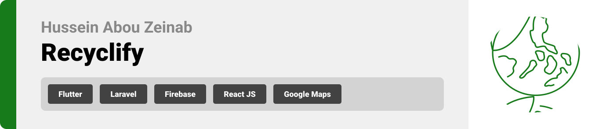
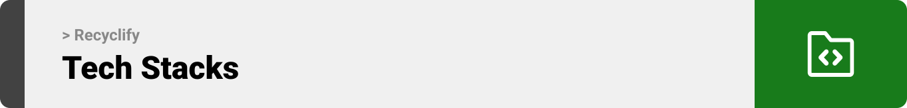
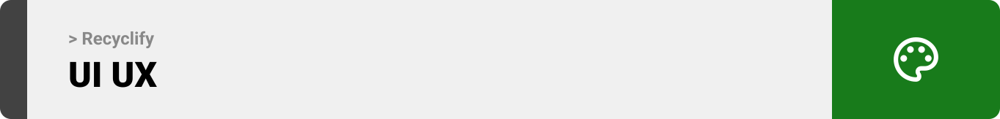
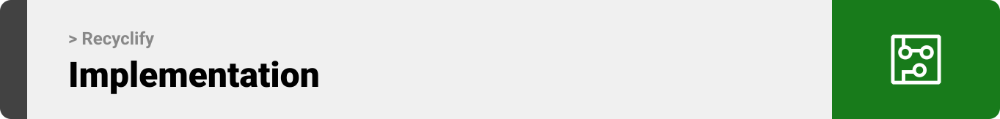
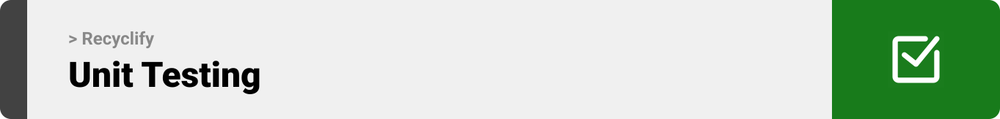

<br><br>

<!-- project philosophy -->


> Recyclify is a mobile application designed to streamline the efforts of environmentalists. Our cutting-edge solution integrates advanced recycling technology, providing users with smart recycling containers equipped with advanced sensors. Our drivers will come to you when your container is full, empowering users by eliminating the need to personally locate recycling centers or manage disposal logistics.

> We believe in creating a greener future by empowering individuals to take simple yet impactful actions through our platform.

### User Stories

#### User

- As a user, I want to have a smart container that measures its fullness.
- As a user, I want to receive notifications about the status of the containers.
- As a user, I want to request a driver when one of the containers is full.

#### Driver

- As a driver, I want to have a chat with the user to confirm the pickup time.
- As a driver, I want to receive notifications when users request a driver.
- As a driver, I want to see the user's location to plan my route efficiently.

#### Admin

- As an admin, I want to view the statistics of users and drivers.
- As an admin, I want to manage users and drivers.
- As an admin, I want to create new drivers.

<br><br>
<!-- Tech stack -->


###  Recyclify is built using the following technologies:

- This project uses the [Flutter app development framework](https://flutter.dev/). Flutter is a cross-platform hybrid app development platform which allows us to use a single codebase for apps on mobile, desktop, and the web.
- For persistent storage (database), the app uses the [Laravel](https://https://laravel.com/) facilitating custom storage schema creation, efficient data management, and seamless integration with local databases.
- To send local push notifications, the app uses the [flutter_local_notifications](https://pub.dev/packages/flutter_local_notifications) package which supports Android, iOS, and macOS.
- The app uses the font ["Roboto"](https://fonts.google.com/specimen/Roboto) as its main font, and the design of the app adheres to the material design guidelines.

<br><br>
<!-- UI UX -->



> We designed Recyclify using wireframes and mockups, iterating on the design until we reached the ideal layout for easy navigation and a seamless user experience.

- Project Figma design [figma](https://www.figma.com/design/tiAnUrwo2JuwhigydQYuu3/Recyclify?node-id=0-1&t=HpSa3lU5BdZMIfPe-0)


### Mockups
| Home screen  | Menu Screen | Order Screen |
| ---| ---| ---|
|  |  |  |

<br><br>

<!-- Database Design -->


###  Architecting Data Excellence: Innovative Database Design Strategies:


<br><br>


<!-- Implementation -->



### User Screens (Mobile)
| Login screen  | Register screen | Landing screen | Loading screen |
| ---| ---| ---| ---|
|  |  |  |  |
| Home screen  | Menu Screen | Order Screen | Checkout Screen |
|  |  |  |  |

### Admin Screens (Web)
| Login screen  | Register screen |  Landing screen |
| ---| ---| ---|
|  |  |  |
| Home screen  | Menu Screen | Order Screen |
|  |  |  |

<br><br>


<!-- Prompt Engineering -->


###  Mastering AI Interaction: Unveiling the Power of Prompt Engineering:

- This project uses advanced prompt engineering techniques to optimize the interaction with natural language processing models. By skillfully crafting input instructions, we tailor the behavior of the models to achieve precise and efficient language understanding and generation for various tasks and preferences.

<br><br>

<!-- AWS Deployment -->


###  Efficient AI Deployment: Unleashing the Potential with AWS Integration:

- This project leverages AWS deployment strategies to seamlessly integrate and deploy natural language processing models. With a focus on scalability, reliability, and performance, we ensure that AI applications powered by these models deliver robust and responsive solutions for diverse use cases.

<br><br>

<!-- Unit Testing -->


###  Precision in Development: Harnessing the Power of Unit Testing:

- This project employs rigorous unit testing methodologies to ensure the reliability and accuracy of code components. By systematically evaluating individual units of the software, we guarantee a robust foundation, identifying and addressing potential issues early in the development process.

<br><br>


<!-- How to run -->


> To set up Coffee Express locally, follow these steps:

### Prerequisites

This is an example of how to list things you need to use the software and how to install them.
* npm
  ```sh
  npm install npm@latest -g
  ```

### Installation

_Below is an example of how you can instruct your audience on installing and setting up your app. This template doesn't rely on any external dependencies or services._

1. Clone the repo

    ```sh
    git clone https://github.com/Huseinaz/Recyclify
    ```

2. Install Laravel dependencies by navigating to the Laravel project directory:

   ```sh
   cd backend
   composer install
   ```

3. Set up your Laravel environment and configure the .env file with your database settings.

   Run Laravel migrations to set up the database:

   ```sh
   php artisan migrate --seed
   ```

4. Navigate to the Flutter app directory:

   ```sh
   cd mobile
   ```

5. Install Flutter dependencies and run the Flutter app on your emulator or connected device:

   ```sh
   flutter pub get
   flutter run
   ```

6. Navigate to the ReactJS project directory:

   ```sh
   cd frontend
   ```

7. Install ReactJS dependencies and run the ReactJS app:

   ```sh
   npm start
   ```

Now, you should be able to run Recyclify locally and explore its features.
